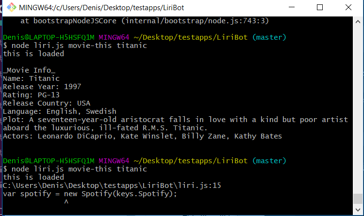
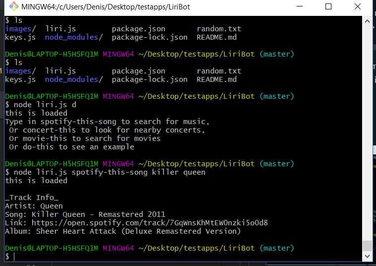

# LiriBot

Liri bot is a very simplified version of siri that can only look up songs, movies, and what bands might be in town. This app uses several api's and node packages in order to get it working.

It works by going into the command line then calling node liri.js and then you have to input one of the commands:

    - concert-this ==> for concert information
    - spotify-this-song ==> for song information
    - movie-this ==> for movie information 
    - do-what-it-says ==> just a default 

You can now search for the movie or song that you want and it will give you the information

Ex:

### Movies 

### Bands in Town

### Songs

If you do make a mistake when searching for something you will get a message with information on how to search and commands to use.

One of the main issues that I manage to solve was a problem that I was having with the Spotify app where I kept getting an error but I fixed it by changing a mistake that I made within the .env file which has my spotify id and secret.

